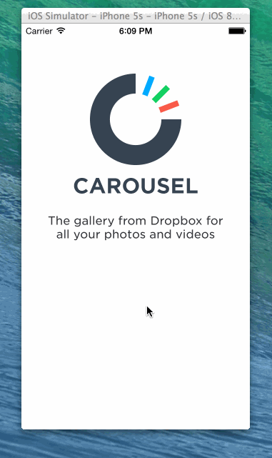

How many hours did it take to complete?

9

Which required and optional stories have you completed?

* Optional: When the keyboard is visible, if the user pulls down on the scrollview, it will dismiss the keyboard.
* Optional: User can page between the screens with updated dots
* Optional: Upon reaching the 4th page, hide the dots and show the "Take Carousel for a Spin" button.
* Optional: Show the "Learn more about Carousel" button in the photo timeline.
* Optional: Tap the X to dismiss the banner
* Optional: Track the 3 events:
*   View a photo full screen
*   Swipe left and right
*   Share a photo
* Optional: Upon completion of the events, mark them green.

